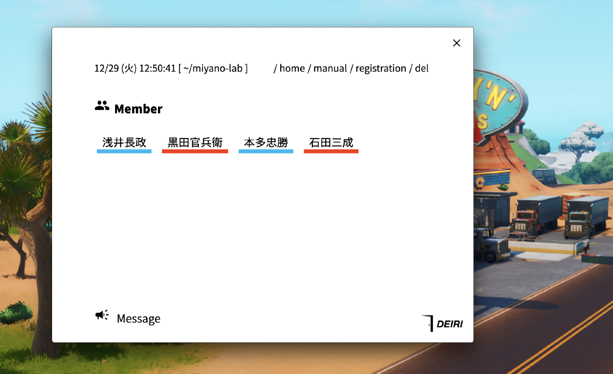
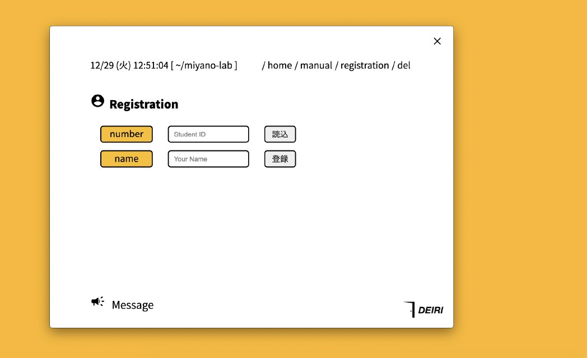

# DEIRI


`DEIRI`は学生証を用いて、研究室・実験室の入退室を管理するアプリです。

<br>

## Description

学生証をカードリーダーにかざすことで、研究室や実験室の利用履歴を記録していきます。   
画面上には在室状況が表示されます。   


fig.1 mainページ   

<br>


学生証の登録や削除もアプリ内で行うことが可能です。   


fig.2 登録ページ   

<br>

## Install

[Python](https://www.python.org/)と[Yarn](https://classic.yarnpkg.com/ja/)を使用します。以下の手順でインストールし、実行が可能です。

```bash
% git clone https://github.com/llbxg/deiri.git
% cd deiri
% yarn install
% pip install -r requirements.txt
% yarn start
```

`electron-builder`を用いてパッケージ化することも可能です。

```bash
% yarn dist
```

ターゲットとするフォーマットがある場合は`package.json`のscriptsを変更してください。

<br>

## Note

`nfcpy`を利用するため、以下のサポートされているデバイスを使用する必要があります。

[Supported Devices | nfcpy](https://nfcpy.readthedocs.io/en/latest/overview.html#supported-devices)

<br>

## Included Libraries

|| Libraries | License |
| ------------- | ------------- | ------------- |
|js| [electron](https://www.electronjs.org/) | MIT License |
|js| [electron-builder](https://www.electron.build/) | MIT License |
|js| [python-shell](https://github.com/extrabacon/python-shell) | MIT License |
|py| [Eel](https://github.com/samuelhwilliams/Eel) | MIT License |
|py| [nfcpy](https://nfcpy.readthedocs.io/en/latest/index.html) | European Union Public License 1.1 |
|py| [pygame](https://www.pygame.org/news) | GNU LGPL version 2.1 |
|py| [jinja2](https://palletsprojects.com/p/jinja/) | BSD 3-Clause "New" or "Revised" License |


<br>

## Author

[:octocat: kosh](https://github.com/llbxg)   